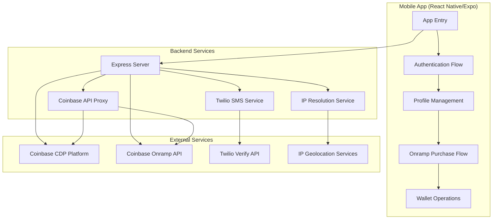
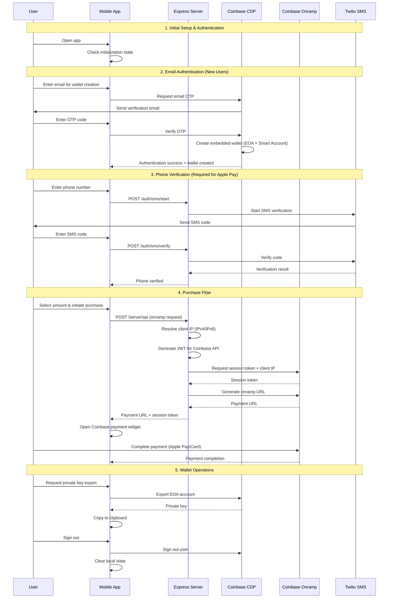

# Onramp v2 - Architecture & Flow Documentation

## Overview
A React Native/Expo mobile application that enables users to purchase cryptocurrency using Coinbase's embedded wallet and onramp services. The app supports both production and sandbox modes with comprehensive authentication flows.

## System Architecture



## User Flow Sequence Diagram



## Component Architecture

### Frontend (Mobile App)
```
app/
├── _layout.tsx              # Root provider with CDP configuration
├── (tabs)/
│   ├── index.tsx           # Home screen with onramp integration
│   └── profile.tsx         # Wallet management & user settings
├── email-verify.tsx        # Email authentication flow
├── email-code.tsx          # Email OTP verification
├── phone-verify.tsx        # Phone number verification
└── phone-code.tsx          # SMS OTP verification
```

### Backend (Express Server)
```
server/src/
├── app.ts                  # Main server with proxy endpoints
├── ip.ts                   # IP resolution service (IPv4/IPv6)
└── index.ts               # Server entry point
```

## Key Technical Features

### 1. Dual Wallet Architecture
- **EOA (Externally Owned Account)**: For private key export
- **Smart Account**: Primary wallet for transactions

### 2. Environment Support
- **Production Mode**: Real transactions, full verification required
- **Sandbox Mode**: Test transactions, optional verification

### 3. Cross-Platform Compatibility
- **Expo Go**: Development with polyfills
- **TestFlight/Production**: Native crypto libraries

### 4. Authentication Methods
- **Email OTP**: Primary authentication via Coinbase CDP
- **SMS Verification**: Required for Apple Pay integration

## Data Flow

### 1. Wallet Creation
```
Email → OTP Verification → CDP Account Creation → Wallet Generation (EOA + Smart)
```

### 2. Purchase Flow
```
Amount Selection → Phone Verification → IP Resolution → Session Token → Onramp Widget → Payment
```

### 3. Export Flow
```
User Request → Confirmation Modal → EOA Export → Clipboard Copy → Security Warning
```

## Security Considerations

### 1. Session Token Management
- Single-use tokens to prevent reuse
- Server-side IP injection
- No token exposure in URLs

### 2. Private Key Handling
- Export only EOA accounts
- Immediate clipboard copy
- Clear security warnings

### 3. IP Resolution
- IPv6 support for backend compatibility
- Private IP detection and public IP fallback
- Caching to reduce external calls

## Configuration

### Environment Variables
```bash
# CDP Configuration
EXPO_PUBLIC_CDP_PROJECT_ID=your_project_id
CDP_API_KEY_ID=your_api_key
CDP_API_KEY_SECRET=your_secret

# Twilio Configuration
TWILIO_ACCOUNT_SID=your_sid
TWILIO_AUTH_TOKEN=your_token
TWILIO_VERIFY_SERVICE_SID=your_service_sid

# Build Configuration
EXPO_PUBLIC_USE_EXPO_CRYPTO=true  # For Expo Go
```

### Metro Configuration
- Custom resolvers for CDP packages
- Node.js polyfills for React Native
- Package export field compatibility

## Testing Flows

### 1. New User Flow
1. Open app → Connect wallet
2. Enter email → Verify OTP → Wallet created
3. Verify phone → Enter SMS code
4. Select amount → Complete purchase

### 2. Export Flow
1. Ensure wallet is connected
2. Tap "Export private key" → Confirm
3. Private key copied to clipboard

### 3. Sandbox Testing
1. Enable sandbox mode
2. Enter test wallet address
3. Test onramp flow without real transactions

## Dependencies

### Core Libraries
- `@coinbase/cdp-hooks`: Wallet and authentication
- `@coinbase/cbpay-js`: Onramp URL generation
- `expo-router`: Navigation
- `twilio`: SMS verification

### Polyfills (React Native)
- `react-native-quick-crypto`: Crypto operations
- `@craftzdog/react-native-buffer`: Buffer polyfill
- Various Node.js polyfills for web3 compatibility

This architecture provides a secure, scalable foundation for cryptocurrency onramp functionality with comprehensive user authentication and wallet management.